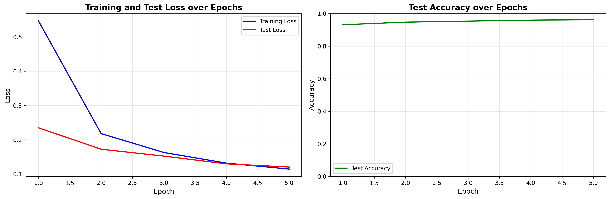
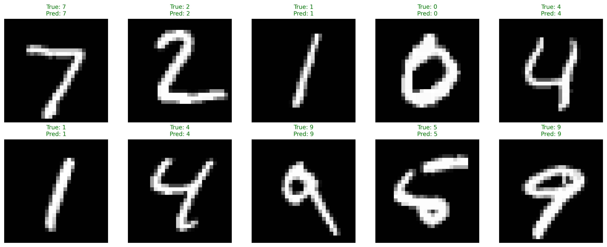

[](https://classroom.github.com/a/_jPLkVl3)
# Installation instructions

This should give an explanation on how to install the library in editable mode inside a Python venv, virtualenv or conda environment. 
Dependencies besides PyTorch should be installed when running the `pyproject.toml`. Document all the steps with the commands using screenshots. 
You only need to explain how to run this on your system (pool computer, private laptop etc.) with your specific OS (e.g. Windows, Ubuntu, MacOS).

## 1. Create venv, virtualenv or conda env

I create a new virtual environment using conda comands in a powershell terminal
```bash
conda create -n dlcv_env python=3.8
```
see images\1 step create virtual env.png

## 2. Activate venv or virtualenv

Now I had to activate, in the same powershell 

```bash
conda activate dlcv_env
```
see images\2, 3 step activate and isntall project in editable mode.png
## 3. Install project in editable mode

Install the project in editable mode with dependencies:

```bash
pip install -e .
```

## 4. Install missing hardware-specific dependencies (PyTorch)


```bash

pip install torch torchvision torchaudio pytest numpy matplotlib pillow

or 

conda install pytorch torchvision torchaudio cpuonly -c pytorch
conda install pytest numpy matplotlib pillow -c conda-forge
```
```
see images\4 step Install specific libraries.png


## 5. Git committing with the command line interface

Stage and commit your changes:

```bash
git add .
see C:\Users\verwalter\Desktop\dlcv25-assignment-1-Cesar421\images\5.1 step git add.png
git commit -m "Your commit message"
see C:\Users\verwalter\Desktop\dlcv25-assignment-1-Cesar421\images\5.2 step git commit.png
git push origin main
```

# Preparation - Downloading MNIST Dataset

I run the utils.py code see images\download MNIST Dataset.png
`python src/mynet/utils.py data`


# Running test locally

If you configured your environment correctly, you are able to check the test cases without pushing them to github on your local machine. In the project root folder run the following command:

`pytest -v`

If you are using an IDE and run a test case separately, make sure you set the working directory to the project root. Otherwise, the test will not work since it searches files in different directories.

### Main Libraries
- `torch` 
- `torchvision`
- `torchaudio` 
- `Matplotlib` 
- `NumPy` 
- `Pillow` 
- `pytest` 

# Visualization Results

## Training the Model

To train the model and generate visualizations, run:

```bash
cd src/mynet
python main.py
```

This will:
- Train the model for 5 epochs
- Generate training/test loss and accuracy plots
- Create inference predictions on test data
- Save visualizations to the `images/` folder
- Save the trained model weights

## Loss and Accuracy Plot

The training history shows the progression of training loss, test loss, and test accuracy over epochs:



**Key Observations:**
- Training and test loss decrease over epochs, indicating the model is learning
- Test accuracy improves as training progresses
- The learning rate scheduler helps fine-tune the model after epoch 30

## Inference Results on Test Data

Sample predictions on the test dataset with ground truth labels (green = correct, red = incorrect):



The model successfully classifies MNIST digits with the accuracy shown in the training history plot above.

## Model Architecture

- **Input Layer**: 784 neurons (28×28 flattened images)
- **Hidden Layer 1**: 32 neurons with ReLU activation
- **Hidden Layer 2**: 64 neurons with ReLU activation
- **Output Layer**: 10 neurons (digits 0-9)
- **Optimizer**: SGD with momentum (lr=0.01, momentum=0.9)
- **Loss Function**: CrossEntropyLoss
- **Scheduler**: StepLR (reduces learning rate by 0.1 every 30 epochs)

## Conclusions

- After 10 epochs the model start to overfitting for that reason i re run to 5 epochs. 
- I used SGD with a momentum of 0.9 as a hyperparameter. I made this choice because, according to some papers I reviewed, SGD is an effective optimizer for finding a good local minimum in the loss landscape.

## Training Metrics

Epoch-by-Epoch Results:

| Epoch | Train Loss | Test Loss | Test Accuracy |
|-------|------------|-----------|---------------|
| 1     | 0.5468     | 0.2348    | 0.9315        |
| 2     | 0.2180     | 0.1723    | 0.9476        |
| 3     | 0.1628     | 0.1522    | 0.9538        |
| 4     | 0.1317     | 0.1297    | 0.9600        |
| 5     | 0.1144     | 0.1203    | 0.9622        |

## Final Results:
 - Best Test Accuracy: 0.9622 (Epoch 5)
 - Final Train Loss: 0.1144
 - Final Test Loss: 0.1203
 - Final Test Accuracy: 0.9622