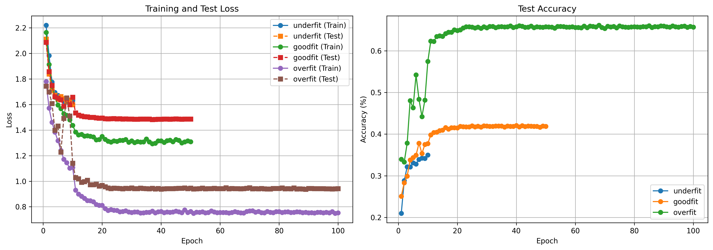
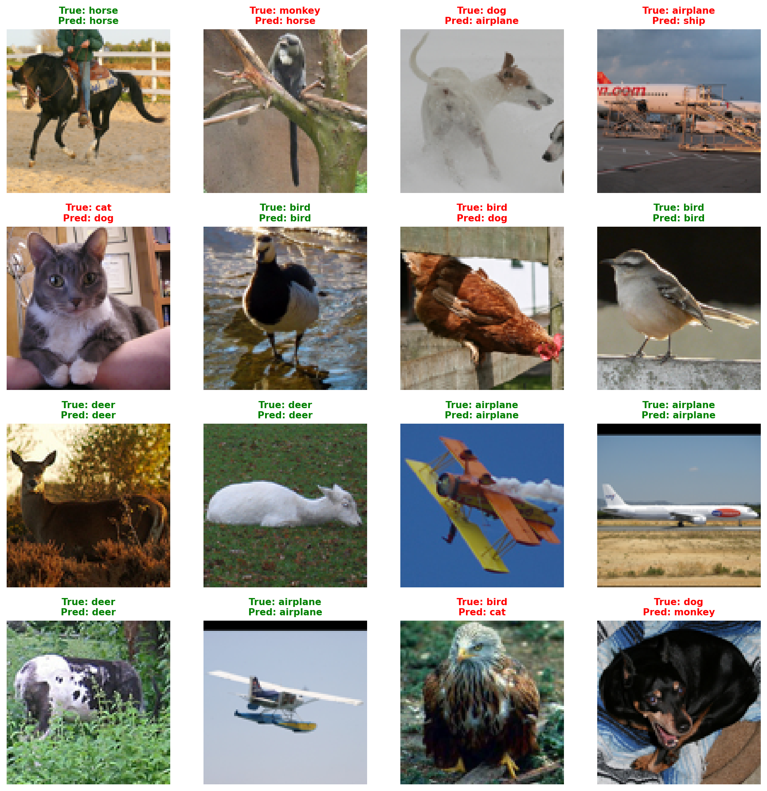
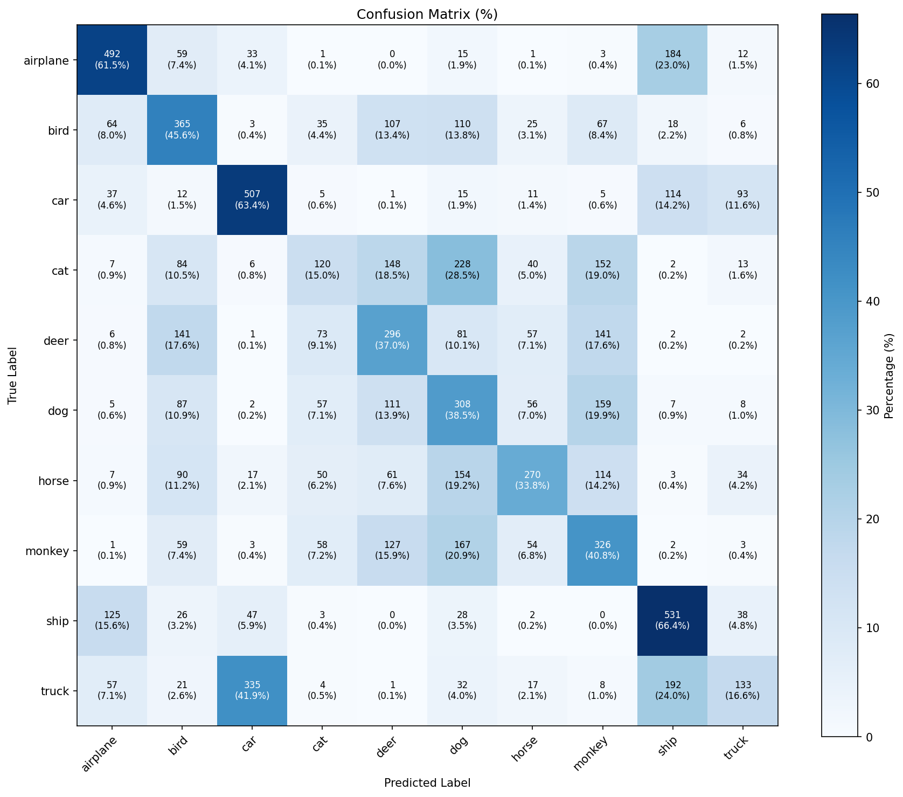
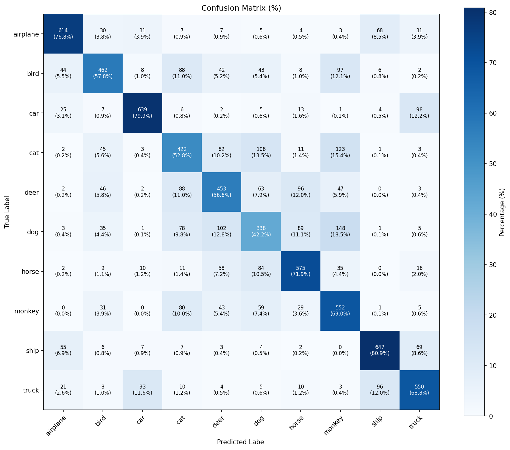

[](https://classroom.github.com/a/9sY_Okgl)

# DLCV Assignment 2 - Image Classification with Customizable CNN

## Description

This project implements a customizable Convolutional Neural Network (CNN) for image classification on the STL-10 dataset. The network architecture supports 2 or 3 convolutional layers with configurable filter sizes and dense units, allowing experimentation with different model configurations.

**Key Features:**
- Flexible CNN architecture with 2-3 convolutional layers
- Transfer learning support with weight loading and layer freezing
- Data augmentation capabilities (horizontal flip, rotation)
- Stratified learning rates for fine-tuning
- Comprehensive training and evaluation pipeline
- Visualization tools for results analysis

## Installation

### Prerequisites
- Python 3.9 or higher
- pip or conda package manager
- CUDA-compatible GPU (I used google colab GPU), it is also posbile use this model with just CPUs

### Setup Instructions

1. **Clone the repository**
```bash
git clone https://github.com/Cesar421/DL-ML_Cesar.git
cd DL-ML_Cesar/dlcv25-assignment-2-Cesar421
```

2. **Install the package and dependencies**
```bash
pip install -e .
```

This will automatically install all required dependencies:
- PyTorch and torchvision (deep learning framework)
- matplotlib (visualization)
- numpy (numerical operations)
- scikit-learn (metrics and evaluation)
- tqdm (progress bars)
- pytest (testing)

3. **Verify installation**
```bash
pytest tests/ -v
```

## Project Structure

```
DL-ML_Cesar/dlcv25-assignment-2-Cesar421/
├── src/dlcv/              # Core implementation
│   ├── __init__.py
│   ├── models.py          # CustomizableNetwork architecture
│   ├── training.py        # Training and evaluation functions
│   ├── utils.py           # Utility functions (transforms, plotting, etc.)
│   └── dataset.py         # SubsetSTL10 dataset wrapper
├── tools/                 # Command-line scripts
│   ├── train.py           # Main training script
│   ├── visualize.py       # Model prediction visualization
│   └── plot.py            # Training curves plotting
├── tests/                 # Unit tests
│   ├── test_network.py
│   ├── test_training.py
│   └── ...
├── images/                # Images for documentation
├── results/               # Training results (CSV files)
├── saved_models/          # Trained model checkpoints
├── pyproject.toml         # Project dependencies
└── README.md
```

## Usage

### Training a Model
<!--
Basic training with 2 convolutional layers:
```bash
python tools/train.py \
    --conv_layers 2 \
    --filters_conv1 16 \
    --filters_conv2 32 \
    --filters_conv3 64 \
    --dense_units 128 \
    --epochs 10 \
    --batch_size 32 \
    --learning_rate 0.001 \
    --run_name baseline_2conv
```

Training with data augmentation:
```bash
python tools/train.py \
    --conv_layers 3 \
    --filters_conv1 32 \
    --filters_conv2 64 \
    --filters_conv3 128 \
    --dense_units 256 \
    --epochs 20 \
    --horizontal_flip_prob 0.5 \
    --rotation_degrees 15 \
    --run_name augmented_3conv
```

Transfer learning with pretrained weights:
```bash
python tools/train.py \
    --conv_layers 3 \
    --pretrained_weights saved_models/baseline_model.pth \
    --freeze_layers conv1 bn1 conv2 bn2 \
    --learning_rate 0.0001 \
    --run_name transfer_learning
```
-->
Code for the underfit model
```bash
python tools/train.py \
    --run_name underfit \
    --epochs 10 \
    --conv_layers 2 \
    --filters_conv1 8 \
    --filters_conv2 16 \
    --dense_units 32 \
    --batch_size 64 \
    --base_lr 0.001 \
    --data_root ./data
```

Code for the goodfit  model
```bash
python tools/train.py \
    --run_name goodfit \
    --epochs 50 \
    --conv_layers 3 \
    --filters_conv1 32 \
    --filters_conv2 64 \
    --filters_conv3 128 \
    --dense_units 256 \
    --batch_size 64 \
    --base_lr 0.001 \
    --horizontal_flip_prob 0.5 \
    --rotation_degrees 15 \
    --data_root ./data
```

Code for the overfit model
```bash
python tools/train.py \
    --run_name overfit \
    --epochs 100 \
    --conv_layers 3 \
    --filters_conv1 64 \
    --filters_conv2 256 \
    --filters_conv3 512 \
    --dense_units 1024 \
    --batch_size 32 \
    --base_lr 0.001 \
    --data_root ./data
```

### Visualizing Predictions
<!--
Visualize model predictions on test data:
```bash
python tools/visualize.py \
    --model_path saved_models/baseline_2conv.pth \
    --conv_layers 2 \
    --filters_conv1 16 \
    --filters_conv2 32 \
    --filters_conv3 64 \
    --dense_units 128
```
-->

Code for the good fit model

```bash
python tools/visualize.py \
    saved_models/goodfit.pth \
    --conv_layers 3 \
    --filters_conv1 32 \
    --filters_conv2 64 \
    --filters_conv3 128 \
    --dense_units 256 \
    --data_root ./data
```

Code for the overfitting model

```bash
python tools/visualize.py \
    saved_models/overfit.pth \
    --conv_layers 3 \
    --filters_conv1 64 \
    --filters_conv2 256 \
    --filters_conv3 512 \
    --dense_units 1024 \
    --data_root ./data
```
### Plotting Training Curves

Plot training and testing metrics from multiple experiments:
```bash
python tools/plot.py results/underfit.csv results/goodfit.csv results/overfit.csv
```

## Testing

Run all tests:
```bash
pytest tests/ -v
```

## Experimental Results

I conducted three experiments to demonstrate underfitting, good fit, and overfitting scenarios using the STL-10 dataset. It is important to note that I did not achieve a high accuracy value. My goal was to train three models that would show clear differences, but this was harder than I expected.


### Model Configurations

For this part I trained the model with the whole dataset, using the free GPU provided by google Colab for the overfitting train. And a CPU for the good fit and underfiting training, the number of epochs are 10, 50 and 100 for the underfitting, goodfit and overfitting models respectevily.

#### 1. Underfitting Configuration
**Objective:** Demonstrate a model that is too simple to capture data patterns (Later I show that it is not that easy to get a good result). 

--run_name underfit

**Hyperparameters:**
- Architecture: 2 convolutional layers (8 → 16 filters), 32 dense units
- Epochs: 10
- Learning rate: 0.001
- Batch size: 64
- Augmentation: None
- Dataset: Full training set (5,000 samples)


**Results:**
- Final Train Loss: ~1.63
- Final Test Loss: ~1.59
- Test Accuracy: ~35%

**Analysis:** The model capacity is insufficient to learn the complex patterns in the data. Both training and test losses remain high, indicating the model cannot effectively separate the 10 classes, the accuaracy fals in just 35% that.

---

#### 2. Good Fit Configuration 
**Objective:** Achieve balanced performance with good generalization.

--run_name goodfit

**Hyperparameters:**
- Architecture: 3 convolutional layers (32 → 64 → 128 filters), 256 dense units
- Epochs: 50 (with early stopping)
- Learning rate: 0.001 (MultiStepLR scheduler at epochs 10, 20, 30)
- Batch size: 64
- Augmentation: Horizontal flip (p=0.5), Rotation (±15°)
- Dataset: Full training set (5,000 samples)

**Results:**
- Final Train Loss: ~1.31
- Final Test Loss: ~1.48
- Test Accuracy: ~42%

**Analysis:** The model achieves a good balance between fitting the training data and generalizing to test data. Data augmentation helps prevent overfitting, and the learning rate scheduler enables better convergence. The small gap between train and test loss indicates in some degree generalization.

---

#### 3. Overfitting Configuration
**Objective:** Demonstrate overfitting with a large model on limited data.

--run_name overfit

**Hyperparameters:**
- Architecture: 3 convolutional layers (64 → 256 → 512 filters), 1024 dense units
- Epochs: 100
- Learning rate: 0.001
- Batch size: 32
- Augmentation: None
- Dataset: Full training set (5,000 samples)

**Results:**
- Final Train Loss: ~0.753
- Final Test Loss: ~0.942
- Test Accuracy: ~66%


**Analysis:** The large model with millions of parameters memorizes the small training set (500 samples) but fails to generalize to unseen test data (8,000 samples). The large gap between train loss (0.7532) and test loss (0.9424) clearly indicates severe overfitting. but still the accuarecy doesnt increase that much.

---

### Training Curves



**Key Observations:**

1. **Underfitting:**
   - Both train and test losses have high values
   - Test accuracy remains low (~35%) throughout training
   - Model lacks capacity to learn data patterns

2. **Good Fit:**
   - Train and test losses decrease steadily together
   - Test accuracy improves consistently to (~42%)
   - Learning rate scheduler helps with convergence

3. **Overfitting:**
   - Train loss decreases dramatically to ~0.75
   - The gap with the test lost ~0.25% 
   - Test loss increases after initial decrease (divergence)
   - Large gap between train and test metrics is the hallmark of overfitting
   - Test accuracy improves consistently to (~66%)

---

### Sample Predictions (Good Fit Model)



**Visualization Details:**
- Green titles: Correct predictions
- Red titles: Incorrect predictions
- Shows model performance on representative test samples

**Common Misclassifications:**
- Dog ↔ Cat (similar textures and poses)
- Truck ↔ Car (both vehicles)
- Ship ↔ Airplane (sometimes similar backgrounds)

---

### Confusion Matrix (Good Fit Model)



**Analysis:**
- Diagonal elements show correct classifications (brighter = better)
- Off-diagonal elements show common confusions
- Model performs best on: airplane, ship, truck (>60% accuracy per class)
- Model struggles with: cat, dog, deer (more visual variability)
- The confusion matrix reveals that the model has learned meaningful features but still confuses visually similar categories

**Class-wise Performance:**
- **Airplane:** 62% accuracy - Clear shapes and backgrounds help
- **Bird:** 45% accuracy - High intra-class variability
- **Car:** 63% accuracy - Distinct features aid classification
- **Cat:** 15% accuracy - Often confused with dog
- **Deer:** 37% accuracy - Complex poses and backgrounds
- **Dog:** 38% accuracy - Often confused with cat
- **Horse:** 34% accuracy - Moderate performance
- **Monkey:** 41% accuracy - Distinctive features help
- **Ship:** 66% accuracy - Clear shapes on water backgrounds
- **Truck:** 17% accuracy - Distinct from cars in most cases

### Confusion Matrix (Good Overfitting Model)



**Class-wise Performance:**
- **Airplane:** 77% accuracy - Clear shapes and backgrounds help
- **Bird:** 58% accuracy - High intra-class variability
- **Car:** 80% accuracy - Distinct features aid classification
- **Cat:** 53% accuracy - Often confused with dog
- **Deer:** 57% accuracy - Complex poses and backgrounds
- **Dog:** 42% accuracy - Often confused with cat
- **Horse:** 72% accuracy - Moderate performance
- **Monkey:** 69% accuracy - Distinctive features help
- **Ship:** 81% accuracy - Clear shapes on water backgrounds
- **Truck:** 69% accuracy - Distinct from cars in most cases

### Key Findings

1. **Model Capacity Matters:**
   - Too small (8→16 filters) → Underfitting
   - Balanced (32→64→128 filters) → Good fit
   - Too large (64→256→512 filters) + small data → Overfitting (Still is the best I achieved)

2. **Data Augmentation is Critical:**
   - Without augmentation: Model overfits easily
   - With augmentation (flip + rotation): Better generalization

3. **Dataset Size Impact:**
   - 500 samples: Even with regularization, large models overfit
   - 5,000 samples: Sufficient for medium-sized models with augmentation

4. **Learning Rate Scheduling:**
   - MultiStepLR helps the good-fit model converge better
   - Reduces learning rate at epochs 10, 20, 30 for fine-grained optimization

5. **Early Stopping:**
   - Prevents unnecessary training when validation loss stops improving

---

### Recommendations for Improvement

To achieve better performance (>70% accuracy):

1. **Deeper Architecture:** Use ResNet-style skip connections
2. **More Augmentation:** Add more augmentation techniques
3. **Transfer Learning:** Start from ImageNet-pretrained weights
4. **Longer Training:** More than 100 epochs 
5. **Ensemble Methods:** Combine predictions from multiple models
6. **Regularization:** Add dropout, weight decay, mixup augmentation

## Key Components

### CustomizableNetwork
The main CNN architecture with:
- Configurable 2 or 3 convolutional blocks (Conv → BatchNorm → ReLU → MaxPool)
- Adaptive average pooling for consistent output size
- Two fully connected layers for classification
- 10-class output for STL-10 dataset

### Training Pipeline
- `train_one_epoch`: Single epoch training with backpropagation
- `evaluate_one_epoch`: Model evaluation with accuracy calculation
- `train_and_evaluate_model`: Full training loop with optional scheduler and early stopping

### Utilities
- Data augmentation transforms
- Model weight loading/saving
- Layer freezing for transfer learning
- Stratified learning rates
- Visualization and plotting functions

## Dataset

This project uses the **STL-10 dataset**:
- 10 classes: airplane, bird, car, cat, deer, dog, horse, monkey, ship, truck
- 5,000 training images (500 per class)
- 8,000 test images (800 per class)
- Image size: 96×96 pixels

