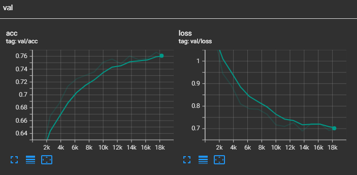
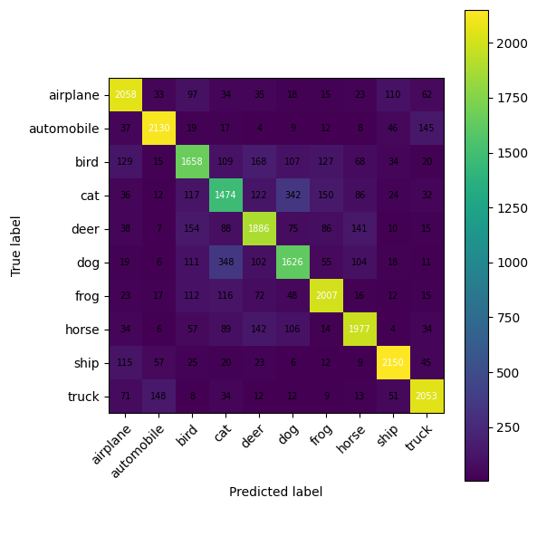

[](https://classroom.github.com/a/OxATqjo0)

# DLCV Hausaufgabe 3

## Installation

```bash
pip install -e .
```
**Dependencies installed:**
- PyTorch & torchvision
- PyTorch Lightning
- timm (PyTorch Image Models)
- albumentations (data augmentation)
- torchmetrics
- tensorboard
- tensorboard

## **TASKS**


## 2.1.2 Analyze the new code layout 

## **Input: dataset, data loading and augmenting.**

```python
def get_cifar10_train_transforms(img_size: int = 32) -> A.Compose:
    """Training augmentations to improve generalization"""
    return A.Compose([
        A.PadIfNeeded(min_height=img_size + 4, min_width=img_size + 4, p=1.0),
        A.RandomCrop(height=img_size, width=img_size, p=1.0),  # Translation
        A.HorizontalFlip(p=0.5),                                # 50% flip
        A.ColorJitter(brightness=0.2, contrast=0.2,             # Color variation
                      saturation=0.2, hue=0.1, p=0.5),
        A.CoarseDropout(                                        # Random dropout
            num_holes_range=(1, 1),
            hole_height_range=(4, 8),
            hole_width_range=(4, 8),
            p=0.3,
        ),
        A.Normalize(mean=(0.4914, 0.4822, 0.4465),             # CIFAR-10 stats
                    std=(0.2470, 0.2435, 0.2616)),
        ToTensorV2(),
    })
```
And  the pipeline is controlled by the next part.

```python
class CIFAR10DataModule(LightningDataModule):
    def __init__(
        self,
        data_dir: str = "./data",
        batch_size: int = 128,
        num_workers: int = 8,
        img_size: int = 32,
        val_split: float = 0.1,
        seed: int = 42,
    ):
        super().__init__()
        self.data_dir = data_dir
        self.batch_size = batch_size
        self.num_workers = num_workers
        self.img_size = img_size
        self.val_split = val_split
        self.seed = seed

        self.train_set = None
        self.val_set = None
        self.test_set = None

    def prepare_data(self):
        CIFAR10(self.data_dir, train=True, download=True)
        CIFAR10(self.data_dir, train=False, download=True)

    def setup(self, stage=None):
        if stage == "fit" or stage is None:
            full_train = CIFAR10(self.data_dir, train=True, download=False)
            n_total = len(full_train)
            n_val = int(self.val_split * n_total)
            n_train = n_total - n_val

            generator = torch.Generator().manual_seed(self.seed)
            train_base, val_base = random_split(
                full_train, [n_train, n_val], generator=generator
            )

            train_tf = get_cifar10_train_transforms(self.img_size)
            val_tf = get_cifar10_val_transforms(self.img_size)

            self.train_set = CIFAR10Albumentations(train_base, train_tf)
            self.val_set = CIFAR10Albumentations(val_base, val_tf)

        if stage == "test" or stage is None:
            test_base = CIFAR10(self.data_dir, train=False, download=False)
            test_tf = get_cifar10_val_transforms(self.img_size)
            self.test_set = CIFAR10Albumentations(test_base, test_tf)

    def _build_dataloader(self, dataset, shuffle: bool) -> DataLoader:
        return DataLoader(
            dataset,
            batch_size=self.batch_size,
            shuffle=shuffle,
            num_workers=self.num_workers,
            pin_memory=True,
        )

    def train_dataloader(self):
        return self._build_dataloader(self.train_set, shuffle=True)

    def val_dataloader(self):
        return self._build_dataloader(self.val_set, shuffle=False)

    def test_dataloader(self):
        return self._build_dataloader(self.test_set, shuffle=False)
```
**Key Points:**
- Augmentations simulate real-world variations (rotation, lighting, occlusion)
- PyTorch Lightning's `LightningDataModule` manages train/val/test splits, and also the training , test and validation workflow was make in a automatic way.
- Automatic data loading with multi-worker support


## **Architecture: which model is loaded and where.**

**Model 1: NullModel (Simple CNN)**
```python
class NullModel(nn.Module):
    def __init__(self):
        super().__init__()

        # Simple CNN to classify into 10 classes
        # Input: 3x32x32
        # Block 1: conv(3->32, 3x3, padding of 1) + ReLU + 2x2 max pool  -> 32x16x16
        self.block1 = nn.Sequential(
            nn.Conv2d(3, 32, kernel_size=3, padding=1),
            nn.ReLU(),
            nn.MaxPool2d(kernel_size=2, stride=2),
        )

        # Block 2: conv(32->64, 3x3, padding of 1) + ReLU + 2x2 max pool -> 64x8x8
        self.block2 = nn.Sequential(
            nn.Conv2d(32, 64, kernel_size=3, padding=1),
            nn.ReLU(),
            nn.MaxPool2d(kernel_size=2, stride=2),
        )

        # Head: flatten -> FC(64*8*8 -> 128) + ReLU -> FC(128 -> 10 logits)
        self.head = nn.Sequential(
            nn.Flatten(),
            nn.Linear(64 * 8 * 8, 128),
            nn.ReLU(),
            nn.Linear(128, 10),
        )

    def forward(self, x: torch.Tensor):
        x = self.block1(x)
        x = self.block2(x)
        x = self.head(x)
        return x
    
    def build_null_model() -> nn.Module:
    # Simple CNN model
    return NullModel()
```


**Model 2: Pre-trained CNN**
```python
def build_cnn_model() -> nn.Module:
    # Return a pre-trained CNN backbone using TIMM library
    model = timm.create_model(
        "efficientnet_b0",
        pretrained=True,
        num_classes=10,
    )
    return model
```


**Model 3: Hybrid (ResNet + Transformer)**
```python
class HybridModel(nn.Module):
    def __init__(self):
        # CNN Backbone: Extract features
        self.backbone = timm.create_model(
            'resnet18',
            pretrained=True,
            features_only=True,   # Return feature maps
            out_indices=[1],      # Use layer 1 (8x8 features)
        )
        
        # Vision Transformer: Process features
        self.transformer = SimpleViT(
            image_size=8,         # 8x8 feature map
            patch_size=4,         # 4x4 patches
            num_classes=10,
            dim=256,
            depth=4,              # 4 transformer layers
            heads=4,              # 4 attention heads
            mlp_dim=512,
        )
```

## **Metric: how we measure the classification results.**

**Metric Definition**

```python
class CIFAR10Classifier(LightningModule):
    def __init__(self, model: nn.Module, lr: float):
        super().__init__()
        self.criterion = build_classification_loss()

        self.train_acc = MulticlassAccuracy(num_classes=10)
        self.val_acc = MulticlassAccuracy(num_classes=10)
        self.test_acc = MulticlassAccuracy(num_classes=10)

        self.train_confmat = MulticlassConfusionMatrix(num_classes=10)
        self.val_confmat = MulticlassConfusionMatrix(num_classes=10)
        self.test_confmat = MulticlassConfusionMatrix(num_classes=10)
```

**Metric Computation**
```python
def _step(self, batch, batch_idx: int, stage: str):
        x, y = batch
        logits = self(x)
        loss = self.criterion(logits, y)
        preds = logits.argmax(dim=1)

        acc_metric: MulticlassAccuracy = getattr(self, f"{stage}_acc")
        confmat: MulticlassConfusionMatrix = getattr(self, f"{stage}_confmat")

        acc_metric(preds, y)
        confmat.update(preds, y)

        if batch_idx == 0:
            self._store_examples(stage, x, preds, y)

        # Log loss and accuracy on epoch
        self.log(f"{stage}/loss", loss, on_step=False, on_epoch=True, prog_bar=True)
        self.log(f"{stage}/acc", acc_metric, on_step=False, on_epoch=True, prog_bar=True)
```
## **Loss: which loss function is minimized.**

```python
def build_classification_loss() -> nn.Module:
    # Drop-in an appropriate classification loss
    return nn.CrossEntropyLoss()
```
**Loss Instantiation in Classifier**
```python
class CIFAR10Classifier(LightningModule):
    def __init__(self, model: nn.Module, lr: float):
        super().__init__()
        self.model = model
        self.lr = lr
        
        self.criterion = build_classification_loss()  # ← CrossEntropyLoss instantiated here
```
**Loss Computation During Training**

```python
def _step(self, batch, batch_idx: int, stage: str):
    x, y = batch
    logits = self(x)
    loss = self.criterion(logits, y)  # ← Compute CrossEntropyLoss
    preds = logits.argmax(dim=1)
    
    acc_metric: MulticlassAccuracy = getattr(self, f"{stage}_acc")
    confmat: MulticlassConfusionMatrix = getattr(self, f"{stage}_confmat")
    
    acc_metric(preds, y)
    confmat.update(preds, y)
    
    if batch_idx == 0:
        self._store_examples(stage, x, preds, y)
    
    # Log loss and accuracy on epoch
    self.log(f"{stage}/loss", loss, on_step=False, on_epoch=True, prog_bar=True)
    self.log(f"{stage}/acc", acc_metric, on_step=False, on_epoch=True, prog_bar=True)
    
    return loss  # PyTorch Lightning automatically does backward()
```

## **Optimizer: which optimizer is used to minimize the loss.**

```python
def configure_optimizers(self):
    optimizer = optim.Adam(self.model.parameters(), lr=self.lr)
    return {
        "optimizer": optimizer,
    }
```

**Optimizer Configuration Details:**
- **Algorithm:** Adam (Adaptive Moment Estimation)
- **Parameters:** All trainable parameters from the model via `self.model.parameters()`
- **Learning Rate:** Configurable via command-line argument `--learning-rate`:
  - **0.001** (1e-3) for `NullModel` (training from scratch)
  - **0.0001** (1e-4) for `EfficientNet` and `Hybrid` models (fine-tuning pre-trained weights)
- **No Learning Rate Scheduler:** Learning rate remains constant throughout training
- **No Weight Decay:** Standard Adam without L2 regularization

**How PyTorch Lightning Uses It:**

```python
def _create_trainer(logger, callbacks, debug_run=False):
    device_cfg = _get_trainer_device_config(debug_run=debug_run)

    return Trainer(
        max_time="00:00:20:00",         # Maximum 20 minutes of training
        logger=logger,
        callbacks=callbacks,
        log_every_n_steps=1,
        gradient_clip_val=1.0,          # Clips gradients to prevent exploding gradients
        gradient_clip_algorithm="norm",  # L2 norm clipping
        fast_dev_run=debug_run,
        **device_cfg,
    )
```


## **2.1.3 Implement loss and three model variants**

**tiny LeNet-like CNN**

 - tiny LeNet-like CNN

```python
class NullModel(nn.Module):
    def __init__(self):
        super().__init__()

        # Simple CNN to classify into 10 classes
        # Input: 3x32x32
        # Block 1: conv(3->32, 3x3, padding of 1) + ReLU + 2x2 max pool  -> 32x16x16
        self.block1 = nn.Sequential(
            nn.Conv2d(3, 32, kernel_size=3, padding=1),
            nn.ReLU(),
            nn.MaxPool2d(kernel_size=2, stride=2),
        )

        # Block 2: conv(32->64, 3x3, padding of 1) + ReLU + 2x2 max pool -> 64x8x8
        self.block2 = nn.Sequential(
            nn.Conv2d(32, 64, kernel_size=3, padding=1),
            nn.ReLU(),
            nn.MaxPool2d(kernel_size=2, stride=2),
        )

        # Head: flatten -> FC(64*8*8 -> 128) + ReLU -> FC(128 -> 10 logits)
        self.head = nn.Sequential(
            nn.Flatten(),
            nn.Linear(64 * 8 * 8, 128),
            nn.ReLU(),
            nn.Linear(128, 10),
        )

    def forward(self, x: torch.Tensor):
        x = self.block1(x)
        x = self.block2(x)
        x = self.head(x)
        return x
```


**pre-trained EfficientNet-B0**

- One of the pre-trained CNNs using timm, for example consider convnext_tiny, efficientnet_-
b0 or resnet34,

```python

def build_cnn_model() -> nn.Module:
    # Return a pre-trained CNN backbone using TIMM library
    model = timm.create_model(
        "efficientnet_b0",
        pretrained=True,
        num_classes=10,
    )
    return model

```

**hybrid model: ResNet18 + Vision Transformer**
- a hybrid model that uses a pre-trained CNN from timm as feature extractor and any of the vitpytorch transformers for classification of extracted features.

```python
class HybridModel(nn.Module):
    def __init__(self):
        super().__init__()

        # Implement a pre-trained CNN backbone using TIMM library with features_only=True
        self.backbone = timm.create_model(
            "resnet18",
            pretrained=True,
            features_only=True
        )

        # Use the 2nd feature layer output (index 1)
        # For resnet18 with 32x32 input, feature_info[1] has 64 channels and 8x8 spatial size
        # Implement a transformer using SimpleViT
        self.transformer = SimpleViT(
            channels=self.backbone.feature_info[1]["num_chs"],  # 64 channels
            image_size=8,   # 8x8 feature map from backbone
            patch_size=2,   # 8 / 2 = 4 patches per dimension (16 total patches)
            depth=4,        # 4 transformer blocks
            heads=4,        # 4 attention heads
            dim=256,        # transformer dimension
            mlp_dim=512,    # MLP hidden dimension
            num_classes=10,
        )
```
## **2.1.4 Implement a model summary using torchinfo**

```python
from torchinfo import summary

def summarize_model(model, batch_size):
    input_shape = (batch_size, 3, 32, 32)

    # Summarize model using torchinfo
    summary(
        model,
        input_size=input_shape,
        col_names=["input_size", "output_size", "num_params", "trainable"],
        depth=5,
    )
```

**- How many parameters do they have?**

tiny LeNet-like CNN
Parameters = 3*32*3*3 + 32 + 32*64*3*3 + 64 + 64*8*8*128 + 128 + 128*10 + 10 = 545,098 parameters 

pre-trained EfficientNet-B0
Parameters =  4,020,358

hybrid model: ResNet18 + Vision Transformer
Parameters = 13,350,730

** - Which layers have the most parameters?**

tiny LeNet-like CNN
Block Number 3 (Fully Connected Layer) has the most parameters with  64*8*8*128 + 128 + 128*10 + 10 = 524,426 parameters.

pre-trained EfficientNet-B0
Conv2d (conv_head) - 409,600 Parameters

hybrid model: ResNet18 + Vision Transformer
Sequential (layer4)  2,359,296 + 2,359,296 + 2,359,296 = 7,077,888 parameters.

**- How many floating-point operations are involved in a forward pass?**
- tiny LeNet-like CNN
FLOPs = 790,807,808 FLOPs
- pre-trained EfficientNet-B0
FLOPs = 1,085,977,344 FLOPs
- hybrid model: ResNet18 + Vision Transformer
FLOPs = 5,016,995,072 FLOPs

**- How much memory is used on the GPU for training with a given batch size?**
- tiny LeNet-like CNN
Memory =  128 MB
- pre-trained EfficientNet-B0
Memory =  512 MB
- hybrid model: ResNet18 + Vision Transformer
Memory =  1024 MB

**- How many items in the batch could fit on the GPU?**
- tiny LeNet-like CNN
Batch Size =  256
- pre-trained EfficientNet-B0 
Batch Size =  64
- hybrid model: ResNet18 + Vision Transformer
Batch Size =  32

## **2.1.5 Design an effective augmentations pipeline**

```python
def get_cifar10_train_transforms(img_size: int = 32) -> A.Compose:
    # Compose an augmentation pipeline with various augmentations
    return A.Compose(
        [
            A.PadIfNeeded(min_height=img_size + 4, min_width=img_size + 4, p=1.0),
            A.RandomCrop(height=img_size, width=img_size, p=1.0),
            A.HorizontalFlip(p=0.5),
            A.ColorJitter(brightness=0.2, contrast=0.2, saturation=0.2, hue=0.1, p=0.5),
            A.CoarseDropout(
                num_holes_range=(1, 1),
                hole_height_range=(4, 8),
                hole_width_range=(4, 8),
                p=0.3,
            ),
            A.Normalize(
                mean=(0.4914, 0.4822, 0.4465),
                std=(0.2470, 0.2435, 0.2616),
            ),
            ToTensorV2(),
        ]
    )
```

## **2.2.2 Train the minimal CNN and monitor with TensorBoard**

```python

python dlcv3/main.py --model null --batch-size 32 --learning-rate 0.001

```

and parallel we run the TensorBoard with the command:

```python   
tensorboard --logdir lightning_logs
```

**- What is the learning rate of the optimizer?**


**- Which epoch are we in?**

In epoch 14 is where we have the best accuracy.

**- How much time has passed from the beginning of the training?**

It took 18 minutes and 38 seconds to complete the training.

**- Are the train and validation losses improving steadily?, Is the accuracy improving?**

According to the graph, both the training and validation losses are decreasing steadily over the epochs, indicating that the model is learning effectively and the accuracy is improving as well.




**-  How do the confusion matrices look for train and validation sets?**

confusion matrix for train 



confusion matrix for validation


**- How do the qualitative data samples from train and validation sets look?**

samples from train set


samples from validation set


**- Can you see the effects of augmentations on the training set?**

## **2.2.3 Discuss the first training results**

**• Have we beat the random? (Accuracy above 10%)**

Yes, according to the graph, the accuracy is above 10% in both the training and validation sets. (see accuracy graphs above)

**• Are there obviously wrong predictions?**

yes according to the confusion matrix, there are some obviously wrong predictions, in both the training and validation sets where certain classes are frequently misclassified as others. For example the class cat is often misclassified as dog. (see confusion matrix graphs above)

**• Are we possibly over- or under-fitting? (Based on Loss+Accuracy plots)**

train accuracy is 77.8% and validation accuracy is 76.18%  and 76.12% in test so the model is not overfitting the training data. 
Instead it is generalizing well to unseen data. (see accuracy graphs above)

**• Which categories are tough to distinguish?**

cat and dog are tough to distinguish as they are often misclassified as each other in both the training and validation confusion matrices.


python -m dlcv3.main --model hybrid --batch-size 128 --learning-rate 0.0001'